<div align="center">


<br/>


<br/><br/>

[](#)
[](#)
[](#)
[](#)
[](#)

</div>



## 📋 Table of Contents

- [What is StackWatch?](#-what-is-stackwatch)
- [Features](#-features)
- [How It Works](#-how-it-works)
- [Install](#-install)
- [Permissions — Why StackWatch Asks For Them](#-permissions--why-stackwatch-asks-for-them)
- [What's New in v2.0](#-whats-new-in-v20)
- [Roadmap](#-roadmap)
- [Contributing](#-contributing)
- [FAQ](#-faq)
- [License](#-license)


## 🟧 What is StackWatch?

**StackWatch** is a Chrome extension (Manifest V3) that fingerprints the frontend and backend technologies running on any site — Wappalyzer-style, grouped by category, with real brand icons — and cross-checks the **exact detected version** of each against known CVEs via **OSV.dev** and **NVD**. Results are deduplicated, scored, and shipped with remediation guidance.

No guessing. No flat lists of "this site uses React." A version, a CVE, a fix.


## ✨ Features

<table>
<tr>
<td width="33%" valign="top">

### 🔍 Detection
- Script / HTML / meta / global-variable regex
- DOM & CSS-selector matching
- Stylesheet content scan (`--tw-*` vars, etc.)
- Header & cookie fingerprinting
- CDN-URL inference
- Active probing (optional)

</td>
<td width="33%" valign="top">

### 🛡️ Vulnerability Intel
- OSV.dev + NVD lookups, cached per product
- Local version-range matching
- CVE dedup + near-duplicate grouping
- CVSS v3.1 scoring from vector strings
- Remediation: suggested fixed version

</td>
<td width="33%" valign="top">

### 🎨 Experience
- Real brand icons (Simple Icons CDN)
- Clean glass-card popup UI
- Badge shows confirmed vuln count only
- Headers tab (CSP / HSTS / CORS analysis)
- Survives MV3 service-worker restarts

</td>
</tr>
</table>


## 🧠 How It Works

```
   1. Visit a page
        │
        ▼
   content/detector.js runs passively
   (scripts, HTML, meta tags, globals,
    DOM selectors, stylesheet vars)
        │
        ▼
   background/service-worker.js
   collects signals → matches against
   75 signatures in lib/signatures.js
        │
        ▼
   For every confirmed tech + version:
   query OSV.dev + NVD (cached)
        │
        ▼
   dedupe.js removes duplicate / near-duplicate CVEs
        │
        ▼
   score.js computes a risk score
   remediation.js attaches a suggested fix
        │
        ▼
   Popup renders: Overview · Stack · Vulnerabilities · Headers
```

Everything happens **locally in your browser** — the only outbound calls are to OSV.dev, NVD, and the Simple Icons CDN for brand logos.


## 🚀 Install

```bash
1. Download the ZIP file
2. Unzip the StackWatch folder
3. Open chrome://extensions
4. Enable Developer mode (top-right toggle)
5. Click "Load unpacked"
6. Select the unzipped project folder
7. Pin it and you are ready to go!
```

Then open the popup's **⚙ Settings**:
- Add an NVD API key *(optional, but recommended — raises your NVD rate limit significantly)*. Get a free one at [nvd.nist.gov/developers/request-an-api-key](https://nvd.nist.gov/developers/request-an-api-key). Click **Show** to verify what you typed before saving.
- Toggle **active probing** on/off


## 🔐 Permissions — Why StackWatch Asks For Them

A security tool asking for browser permissions should explain itself. Here's exactly what each one is for:

| Permission | Why StackWatch needs it |
|---|---|
| `scripting` | Injects `content/detector.js` to read page signals (scripts, DOM, meta tags) — and to re-scan a tab on demand if its state was lost to a service-worker restart. |
| `storage` | Caches per-tab detection results (`storage.session`) and CVE lookups (`storage.local`) so you're not re-querying OSV/NVD on every popup open. |
| `webRequest` / `declarativeNetRequest` | Reads response headers (`Server`, `X-Powered-By`, CDN headers, CSP/HSTS) for header-based fingerprinting and the Headers tab. |
| `activeTab` | Lets the popup act on the tab you're currently viewing without requesting access to every tab you've ever opened. |
| Host permissions (`<all_urls>`) | Needed to detect tech on *any* site you choose to scan — StackWatch only acts on tabs you visit, it does not crawl or scan in the background. |

**StackWatch does not collect, transmit, or sell any browsing data.** Detected tech and CVE results stay in your local browser storage. The only third-party network calls are read-only lookups to OSV.dev, NVD, and the Simple Icons CDN.


## 🆕 What's New in v2.0

<details>
<summary><b>🩹 Fixed — cached / already-open tabs showing nothing</b></summary>
<br/>

**Root cause:** MV3 service workers are ephemeral. Chrome kills them after ~30s idle, wiping the in-memory `Map` that held per-tab results. Tabs already open before the extension loaded — or restored from back/forward cache — never re-trigger the content script, so the popup found no state and told you to reload.

**Fix:**
- Per-tab state now lives in `chrome.storage.session`, surviving worker restarts for the whole browser session.
- When the popup opens and finds *no* state for the current tab, the service worker **actively re-injects** `content/detector.js` via `chrome.scripting.executeScript` — the same trick Wappalyzer uses.
- If no response headers were captured either, a one-off background `fetch()` of the page kicks in as a fallback, so header-based detection (`Server`, `X-Powered-By`, CDN headers) still works.

> [!IMPORTANT]
> `fetch()` can't read `Set-Cookie` for security reasons — cookie-based fingerprinting only fires from a real page-load detection, not this on-demand path. Documented, not hidden.

</details>

<details>
<summary><b>🧩 New detection method — DOM/CSS-selector matching</b></summary>
<br/>

Researched Wappalyzer's own technology schema. The big gap: **checking whether a CSS selector matches anything on the page** — one of its most-used signal types, and something StackWatch didn't do at all before (it only checked script URLs, globals, meta tags, and raw HTML regex).

Added it, plus a stylesheet-content scan for frameworks like **Tailwind** that compile away any fixed class namespace but still leave distinctive `--tw-*` CSS custom properties behind.

**Unlocks:** Video.js, Lucide, Material / Bootstrap / Feather icon libraries, Tailwind CSS, Framer Motion (best-effort), Priority Hints, Next.js (now also via `next-head-count`, not just `__NEXT_DATA__`), Nuxt, Gatsby, Astro, Svelte/SvelteKit.

**Signature count: 36 → 75.**

</details>

<details>
<summary><b>🖼️ Real component icons</b></summary>
<br/>

Pixel-art badges are gone. Icons now come from the **Simple Icons CDN** (`cdn.simpleicons.org/<slug>`) — actual brand logos. Coverage isn't 1:1 for 75+ signatures, so every icon has an `onerror` fallback to a clean line-icon glyph per category instead of a broken image.

</details>

<details>
<summary><b>🔇 Badge noise fixed</b></summary>
<br/>

The toolbar badge used to show the 0–100 risk score even with zero actual vulnerabilities — missing security headers alone could push that number up and make a clean site look like a pile of problems.

The badge now shows **only the count of confirmed vulnerable components**, and shows nothing at all when that count is zero.

</details>

<details>
<summary><b>🎨 New theme</b></summary>
<br/>

Full pivot away from the pixel/terminal look: white/soft-gray background, indigo brand accent, rounded-2xl cards with soft shadows, pill badges and buttons, a subtle gradient blob behind the header mark. Monospace is now reserved for actual data (CVE IDs, versions, hostname) rather than the whole UI.

</details>

<details>
<summary><b>🐛 CVE dedup bug — fixed</b></summary>
<br/>

A dedup step had been dropped in an earlier revision, so the same CVE could appear more than once when OSV returns overlapping advisory records for it.

- Re-added: `lib/dedupe.js`
- Added: near-duplicate advisory grouping (different CVE IDs, same underlying issue — common with incomplete-fix follow-ups), collapsing into one expandable card instead of flat-listing as repeats.

</details>


## 🗺️ Roadmap

- [ ] Chrome Web Store listing (currently unpacked-install only)
- [ ] Firefox / Manifest V2-compatible build
- [ ] Export scan results as JSON/PDF report
- [ ] Historical scan comparison ("what changed since last visit")
- [ ] Bulk-scan mode for a list of URLs
- [ ] Configurable signature pack updates without a full extension update

Have an idea? Open an issue — see [Contributing](#-contributing) below.


## 🤝 Contributing

Contributions are welcome, especially:
- **New signatures** for `lib/signatures.js` (frameworks/libraries StackWatch doesn't detect yet)
- **Icon mappings** for `lib/tech-icons.js`
- Bug reports with a reproducible URL or screenshot

```bash
git clone https://github.com/<your-username>/StackWatch.git
cd StackWatch
# load unpacked in chrome://extensions to test changes live
```

Open a pull request with a clear description of what changed and why. For larger changes, open an issue first so we can discuss the approach.


## ❓ FAQ

**Does StackWatch slow down my browsing?**
No — passive detection runs once per page load and is lightweight. Active probing (optional, off by default) makes a few extra requests only when you trigger it.

**Why didn't it detect a technology I know is there?**
Some frameworks (Django, Laravel, Rails) only show up via cookies on a real page load, not on-demand rescans. Others may simply not have a signature yet — feel free to open an issue or contribute one.

**Is a "vulnerable version" finding a guarantee I'm exploitable?**
No. It means the detected version matches a known CVE's affected range. Treat it as **needs review**, not a verdict — check the linked NVD/OSV advisory for exploitability details.

**Does this work on every site?**
Yes, on any tab you open the popup on — StackWatch only acts on the active tab you choose to scan, never in the background across your other tabs.


## 📄 License

Released under the **MIT License** — free to use, modify, and distribute. See [`LICENSE`](LICENSE) for full terms.


<div align="center">

### Made with 🟧 and a healthy distrust of `package.json`

<sub>Detection &nbsp;•&nbsp; Versioning &nbsp;•&nbsp; CVEs &nbsp;•&nbsp; Remediation — no guessing in between.</sub>

</div>
